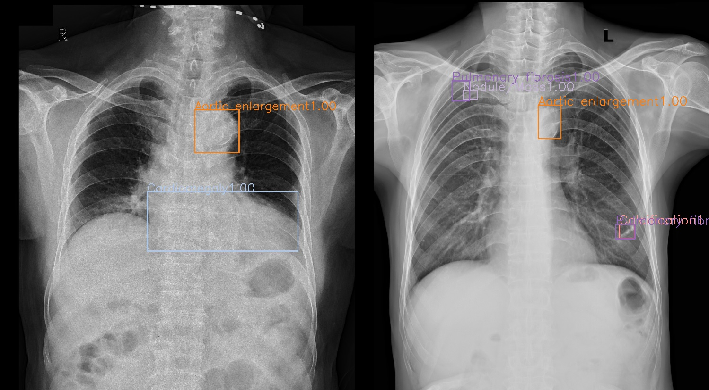

# VinBigData Chest X-ray Abnormalities Detection

## Brief description
Solution of [VinBigData Chest X-ray Abnormalities Detection](https://www.kaggle.com/c/vinbigdata-chest-xray-abnormalities-detection/overview) that achieved 37 place out of 1277 participant. The main task was to construct an algorithm that can provide second opinion for radiologists about accurately identifing and localizing findings on chest X-rays.

Data: 15000 chest x-ray dicoms. Labels - 14 classes of abnormalities with bbox. ~4400 dicoms have some abnoramlities.

Metric: MAP@[IoU=0.4]

Challenges: Noisy labels from multiple radiologists without consensus


## Final results
5 fold cross-validation local CV
```text
+--------------------+-------+--------+--------+-------+
| class              | gts   | dets   | recall | ap    |
+--------------------+-------+--------+--------+-------+
| Cardiomegaly       | 2313  | 74520  | 0.998  | 0.891 |
| Aortic enlargement | 3073  | 69421  | 0.998  | 0.889 |
| Pleural thickening | 3365  | 256081 | 0.925  | 0.354 |
| ILD                | 632   | 95604  | 0.921  | 0.365 |
| Nodule/Mass        | 1761  | 148953 | 0.865  | 0.402 |
| Pulmonary fibrosis | 2631  | 184763 | 0.862  | 0.422 |
| Lung Opacity       | 1760  | 98545  | 0.888  | 0.367 |
| Atelectasis        | 201   | 24478  | 0.841  | 0.322 |
| Other lesion       | 1632  | 241809 | 0.776  | 0.159 |
| Infiltration       | 853   | 42089  | 0.905  | 0.502 |
| Pleural effusion   | 1306  | 93543  | 0.936  | 0.606 |
| Calcification      | 678   | 71238  | 0.891  | 0.237 |
| Consolidation      | 399   | 26549  | 0.882  | 0.415 |
| Pneumothorax       | 112   | 38163  | 0.821  | 0.470 |
| No finding         | 10606 | 15000  | 1.000  | 0.988 |
+--------------------+-------+--------+--------+-------+
| mAP                |       |        |        | 0.493 |
+--------------------+-------+--------+--------+-------+
```

## Solution overview and experiments

### Preprocessing
Final choices:
- Multiple radiologists data consolidation with weighted boxes fusion
- Processed image resolution 1024 * 1024
- Input to models as one channel image with VOI-LUT transform and monochrome fixing https://www.kaggle.com/raddar/convert-dicom-to-np-array-the-correct-way

Less successful approaches:
- Leave only the high-precision boxes when multiple radiologists agreed defined by IoU > 0.15
- Resolution different than 1024 * 1024
- Multiple radiologists data consolidation with NMS
- Input to models as an image channel: CLAHE, histogram equalization, contrast stretching, prediction of lung mask from semantic segmentation that I trained on https://www.kaggle.com/nikhilpandey360/chest-xray-masks-and-labels


### Modeling
Final choices:
- Augmentation: HSV changes, small rotations and shifts, scale changes, MixUp, left-right flips
- Add normal image to training with proportion 1:4
- 5 ScaledYoloV4 models https://arxiv.org/abs/2011.08036
- Exponential moving average and synchronized batch normalization during training helped a lot

Less successful approaches:
- Augmentation: CutOut, bbox jittering
- Pretrain model on external data or use them with small weight https://github.com/Deepwise-AILab/ChestX-Det10-Dataset https://www.kaggle.com/nih-chest-xrays/data 
- Models: DetectoRS, YOLOv5, Cascade R-CNN, RetinaNet
- Label smoothing and FocalLoss for classification and object part of full ScaledYoloV4 loss
- Stochastic weight averaging of last 20 epochs

### Postprocessing
Final choices:
- NMS with IoU 0.5
- And 'No finding' class to all images with probability = 1 - MAX(probability of detected boxes)

Less successful approaches:
- Additional 2 stage 2 class or 14 classes classifiers 
- Ensembling ScaledYoloV4 with DetectoRS or other models from mmdetection

## Minimal hardware requirements
- 32 GB of RAM
- 1 NVIDIA GPU with at least 12 GB of GRAM
- 300 GB of disk space

## Hardware used
5-fold models training time is around 5 days with this configuration
- AMD Ryzen Threadripper 3960X 24 core
- 2 GPU - EVGA GeForce RTX 2080 TI FTW3 ULTRA HYBRID GAMING 12 GB
- 128 GB RAM
- Samsung 970 evo plus 2 TB


# Install and run instructions

Repository contain some amount of code from https://github.com/WongKinYiu/ScaledYOLOv4/tree/yolov4-large and https://github.com/ultralytics/yolov5 

## Repository structure

```text
data
|-raw               --- raw and exteranl data
|-processed         --- processed data
configs             --- configs for training models of DetectoRS and ScaledYoloV4 nets, preprocessing and postprocessing scripts
dockerimage         --- docker image description and python dependencies
scripts             --- runnable scripts of pipeline
vinbigdata          --- python package with common code for this competition
results             --- folder with result models and prediction
.*                  --- config for linters and typing checkers
```

## Build and run container

Build image
```
docker build dockerimage/ -t cuda_image
pip install pre-commit
```
Run and enter to the container
```
docker run --gpus '"device=COMMA_SEPARATED_ID_LIST_OF_DEVICES"' --ipc=host -it -d -v /PATH_TO_LOCAL_REPOSITORY:/workdir -p 8888:8888 -p 6006:6006 cuda_image nohup jupyter notebook --ip=0.0.0.0 --port=8888 --allow-root

docker exec -it RUNNING_CONTAINER_ID bash
```
If for you it's easy to work with notebooks every file inside scripts folder can be converted to jupyter notebook by running ipynb-py-convert {SCRIPT_NAME}.py {SCRIPT_NAME}.ipynb.

## Train pipeline
All commands of the pipeline should be executed inside container.
```
#download raw data
sh scripts/download.sh

# preprocess raw dicom and radiologists annotations to VOC 2012 format
sh scripts/full_prerprocess.sh

# Train models - you can skip this step and download trained models
bash scripts/train_models.sh {COMMA_SEPARATED_ID_LIST_OF_DEVICES} {BATCH_SIZE} {IMAGE_SHAPE} {EPOCH_NUMBER}
bash scripts/train_models.sh 0 3 1024 150 # run command for one GPU with 12 GB of VRAM

# Download final model for submission generation if you don't want to retrain it
sh scripts/download_pretrained_models.sh
```
## Evaluate and submit pipeline
All commands of the pipeline should be executed inside container.
```
# Evaluate models by MAP@[IoU=0.4]
PYTHONPATH=. python scripts/validate.py

# generate submission with output submition.csv file in results directory
PYTHONPATH=. python scripts/generate_submission.py
```
validate.py and generate_submission.py can be converted to jupyter notebook with additional visualization of results
